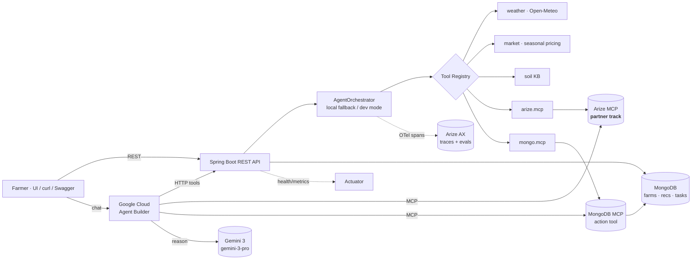

# 🌱 AgriGuardian AI

> An **agentic farm-advisor** built on **Google Cloud Agent Builder** with
> **Gemini 3**, grounded in real weather + market data, that uses the
> **Arize MCP** server to learn from its own past runs.

[](https://github.com/Surendra12345677/AgriGuardian-AI/actions/workflows/build.yml)
[](https://github.com/Surendra12345677/AgriGuardian-AI/actions/workflows/codeql.yml)
[](https://github.com/Surendra12345677/AgriGuardian-AI/actions/workflows/gitleaks.yml)
[](./LICENSE)
[](https://adoptium.net/)
[](https://spring.io/projects/spring-boot)

**Hackathon:** Google Cloud Rapid Agent Hackathon — *Building Agents for Real-World Challenges*
**Partner track:** 🟣 **Arize** (Arize MCP + Arize AX traces)
**Status:** 🚧 Active development — see [`docs/HACKATHON_PLAN.md`](./docs/HACKATHON_PLAN.md)
**Demo video:** _coming soon_ · **Live URL:** _pending GCP billing_

---

## 🎯 Problem

Smallholder farmers face uncertain weather, volatile prices, and rising input
costs, yet most "smart farming" apps give one-shot static tips that ignore
**future** market windows and biodiversity impact.

## 💡 Solution

AgriGuardian AI is a **personal AI farming manager** that:

- 🌾 Recommends the most **profitable** crop given weather, soil, water and
  forecasted market demand
- 📅 Generates a **day-by-day plan**
- 🔄 **Replans dynamically** when the farmer marks tasks done / skipped /
  unaffordable
- 🐝 Optimizes pesticide usage to **protect bees, ants, and biodiversity**
- 💰 Predicts the **best time to sell**
- ✅ Issues an **Eco Farming Trust Score** so farmers can earn premium prices

## 🤖 Why this is an *Agent* (not a chatbot)

| Capability | How |
|---|---|
| Plans tasks | Plan → tool-call → reflect loop, defined in Agent Builder + mirrored in `AgentOrchestrator` |
| Self-aware | Calls **Arize MCP** `search_traces` to look up similar past runs *before* answering |
| Reasons about the future | Gemini 3 + real weather + market trend tools |
| Takes action | Persists plans to MongoDB via **MongoDB MCP** under human approval |
| Adapts dynamically | Task status updates trigger re-planning |
| Human-in-the-loop | Destructive ops require explicit farmer confirmation |
| Observed | Every step is a span exported to Arize AX (OTLP) |

## 🏗️ Architecture



Spans emitted per request: `agent.run` → `planner.plan` → `tool.<name>` →
`gemini.generate` → `reflector.reflect`. See
[`docs/HACKATHON_PLAN.md`](./docs/HACKATHON_PLAN.md) §3 for Arize wiring details.

## 🛠️ Tech Stack

| Layer | Technology |
|---|---|
| Backend | Spring Boot 4 (Java 17, virtual threads) |
| Frontend | Next.js 14 + TypeScript + Tailwind *(planned)* |
| Database | MongoDB |
| LLM | Google **Gemini 3** (`gemini-3-pro`) |
| Agent platform | Google Cloud **Agent Builder** (spec: [`agent-builder/agriguardian-agent.yaml`](./agent-builder/agriguardian-agent.yaml)) |
| **Partner integration** | **Arize MCP** (Model Context Protocol) — qualifies for the Arize partner bucket |
| Observability | **Arize AX** (OpenTelemetry → OTLP) — the agent's own traces flow into Arize |
| Secondary action tool | **MongoDB MCP** — agent persists farm plans under user approval |
| Resilience | Resilience4j (Circuit Breaker + Retry) + Caffeine cache |
| External APIs | Open-Meteo (weather), mock Market Price API |

## 🚀 Quick Start (PowerShell)

### Option A — Docker Compose (recommended, zero local setup)

Requires only **Docker Desktop**. Spins up MongoDB + the app together.

```powershell
git clone https://github.com/Surendra12345677/AgriGuardian-AI.git
cd AgriGuardian-AI
Copy-Item .env.example .env       # edit if you have Gemini/Arize keys; otherwise leave blank for stub mode
docker compose up -d --build
docker compose logs -f app
```

### Option B — Local JDK

#### Prerequisites
- JDK 17 (Temurin recommended)
- MongoDB on `localhost:27017`
- *(Optional)* Gemini + Arize keys — the app **boots keyless** in stub mode

```powershell
git clone https://github.com/Surendra12345677/AgriGuardian-AI.git
cd AgriGuardian-AI
Copy-Item .env.example .env
./gradlew bootRun
```

### Then open
- 📘 Swagger UI: http://localhost:8080/swagger-ui.html
- ❤️ Health:    http://localhost:8080/actuator/health
- 📊 Metrics:   http://localhost:8080/actuator/prometheus

### Try the agent end-to-end
```powershell
# 1. The demo farm is auto-seeded on first dev boot:
Invoke-RestMethod http://localhost:8080/api/v1/farms

# 2. Ask the agent for a plan:
$body = @{ farmId='<paste-id-from-above>'; latitude=18.52; longitude=73.85; preferredCrop='maize' } | ConvertTo-Json
Invoke-RestMethod -Uri http://localhost:8080/api/v1/recommendations `
                  -Method Post -ContentType 'application/json' -Body $body

# 3. Inspect any registered tool directly (what Agent Builder calls):
Invoke-RestMethod -Uri http://localhost:8080/api/v1/tools/weather `
                  -Method Post -ContentType 'application/json' `
                  -Body (@{ latitude=18.52; longitude=73.85 } | ConvertTo-Json)
```

> Stub mode means judges can evaluate the agent flow **without any API key**.

## 🔑 Environment variables

Sourced from [`.env.example`](./.env.example).

| Variable | Required | Purpose |
|---|---|---|
| `GEMINI_API_KEY` | optional | Real Gemini 3 calls; blank → deterministic stub |
| `GEMINI_MODEL` | optional | Default `gemini-3-pro` (also accepts `gemini-3-flash`) |
| `GEMINI_STUB_MODE` | optional | `auto` \| `always` \| `never` |
| `ARIZE_ENABLED` | optional | `true` to export OTLP traces to Arize AX |
| `ARIZE_API_KEY` | optional | Arize Service Key (Member role) |
| `ARIZE_SPACE_ID` | optional | Arize space identifier |
| `ARIZE_OTLP_ENDPOINT` | optional | Default `https://otlp.arize.com/v1` |
| `MCP_ARIZE_ENABLED` | optional | `true` to enable Arize MCP (partner track) |
| `MCP_ARIZE_URL` | optional | Arize MCP server URL |
| `MCP_MONGODB_ENABLED` | optional | `true` to enable MongoDB MCP (action tool) |
| `MCP_MONGODB_URL` | optional | Default `http://localhost:3000/mcp` |
| `MONGODB_URI` | optional | Default `mongodb://localhost:27017/agriguardian` |
| `PORT` | optional | Default `8080` |
| `SPRING_PROFILES_ACTIVE` | optional | Default `dev` |

## 📦 Project layout

```
src/main/java/com/Hackathon/AgriGuardian/AI/
  domain/model/     Farm, Recommendation, Task                          (done)
  domain/repo/      Spring Data Mongo repositories                      (done)
  api/              REST controllers — Farm, Recommendation, Tool       (done)
  api/dto/          Request/response records with bean-validation       (done)
  agent/            AgentOrchestrator + ToolRegistry                    (done)
  agent/tool/impl/  weather, market, soil, arize.mcp, mongo.mcp         (done)
  ai/              GeminiClient (real + stub) — Gemini 3                (done)
  mcp/             McpClient + Arize/MongoDB MCP wiring                 (done)
  config/          Properties, HTTP client, Caffeine cache, OpenAPI     (done)
  observability/   OTel → Arize AX, MDC filter, secret-redacting logs   (done)
  bootstrap/       DemoSeedRunner (1 farm + 3 historical recs)          (done)

agent-builder/      Vertex AI Agent Builder spec + deploy.ps1           (done)
docs/               HACKATHON_PLAN.md (start here)                      (done)
.github/            CI, CodeQL, Dependabot, Gitleaks, templates         (done)
```

## 🏆 Hackathon

- **Event:** Google Cloud Rapid Agent Hackathon — *Building Agents for Real-World Challenges*
- **Partner track:** 🟣 **Arize** — agent uses Arize MCP to consult past evaluations before answering and log feedback after
- **Brain:** Gemini 3 (`gemini-3-pro`) via Google Cloud Agent Builder
- **Agent spec:** [`agent-builder/agriguardian-agent.yaml`](./agent-builder/agriguardian-agent.yaml)
- **Self-aware loop:** every run is exported as a trace to Arize AX (OTLP); the agent then queries those traces via Arize MCP on the next run — closing the observe→learn loop
- **Criteria mapping:** see [`docs/HACKATHON_PLAN.md`](./docs/HACKATHON_PLAN.md) §2

## 🗺️ Roadmap

- [x] Repo bootstrap (license, .gitignore, .gitattributes)
- [x] CI: Gradle build, CodeQL, Dependabot, Gitleaks
- [x] Domain models (`Farm`, `Recommendation`, `Task`)
- [x] Hackathon plan committed
- [x] Spring Data Mongo repositories
- [x] REST API + DTO validation + RFC 7807 error handler
- [x] `AgentOrchestrator` + `ToolRegistry` + 4 tools
- [x] `GeminiClient` (real + stub) — Gemini 3 (`gemini-3-pro`)
- [x] Arize OTel exporter + correlation-id MDC filter
- [x] Resilience4j circuit-breaker + retry + Caffeine cache
- [x] Real Open-Meteo weather + seasonal market price tools
- [x] **Arize MCP integration (partner-track qualifier)**
- [x] **MongoDB MCP integration (secondary action tool)**
- [x] Agent Builder YAML spec + deploy script
- [x] Tool HTTP endpoints (`/api/v1/tools/*`) for Agent Builder to call
- [x] `/api/v1/farms` onboarding CRUD endpoint
- [x] Demo seed (1 farm + 3 historical recommendations on first boot, dev profile)
- [x] Secret-redacting Logback converter (defence-in-depth for log lines)
- [x] Unit + MockMvc tests
- [x] Swagger / OpenAPI UI
- [x] Dockerfile + docker-compose (app + mongo + mongodb-mcp)
- [ ] Cloud Run deployment (blocked on GCP billing)
- [ ] Next.js frontend (onboarding + dashboard)
- [ ] 3-min demo video

## 🤝 Contributing

See [`CONTRIBUTING.md`](./CONTRIBUTING.md) and the
[Code of Conduct](./CODE_OF_CONDUCT.md). Security disclosures: see
[`SECURITY.md`](./SECURITY.md).

## 📜 License

[MIT](./LICENSE) © 2026 Surendra Thakur and AgriGuardian AI Contributors

## 🙏 Acknowledgements

- Google Cloud **Agent Builder** + **Gemini 3** for the agent runtime and reasoning
- **Arize AX** + **Arize MCP** for observability and self-aware retrieval
- **MongoDB MCP** for the action-taking layer
- **Open-Meteo** for free, open weather data

