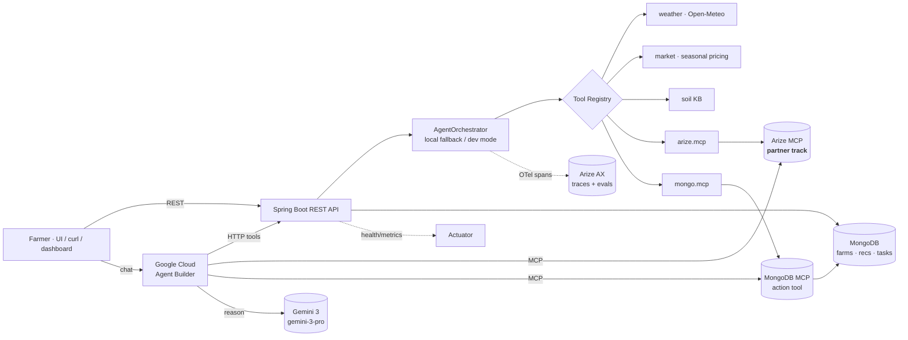

# 🌱 AgriGuardian AI

> An **agentic farm-advisor** built on **Google Cloud Agent Builder** with
> **Gemini 3**, grounded in real weather + market data, that uses the
> **Arize MCP** server to learn from its own past runs.

[](https://github.com/Surendra12345677/AgriGuardian-AI/actions/workflows/build.yml)
[](https://github.com/Surendra12345677/AgriGuardian-AI/actions/workflows/codeql.yml)
[](https://github.com/Surendra12345677/AgriGuardian-AI/actions/workflows/gitleaks.yml)
[](./LICENSE)
[](https://adoptium.net/)
[](https://spring.io/projects/spring-boot)

**Hackathon:** Google Cloud Rapid Agent Hackathon — *Building Agents for Real-World Challenges*
**Partner track:** 🟣 **Arize** (Arize MCP + Arize AX traces)
**Languages:** 13 — English, Hindi, Marathi, Tamil, Telugu, Bengali, Punjabi · Spanish, French, German, Italian, Portuguese, Dutch
**Status:** ✅ Live on Google Cloud Run
**Submission:** [`SUBMISSION.md`](./SUBMISSION.md) · [`DEVPOST_FORM.md`](./DEVPOST_FORM.md) · [`docs/CLOUD_SHELL_REDEPLOY.md`](./docs/CLOUD_SHELL_REDEPLOY.md)
**🌐 Live demo:** **https://agriguardian-web-963977203522.us-central1.run.app**
**🔌 Backend API base:** https://agriguardian-ai-zqafbkccaa-uc.a.run.app/api/v1
**❤️ Backend health:** https://agriguardian-ai-zqafbkccaa-uc.a.run.app/actuator/health
**Demo video:** _add your unlisted YouTube/Vimeo URL here before final Devpost submission_

---

## 🎯 Problem

Smallholder farmers face uncertain weather, volatile prices, and rising input
costs, yet most "smart farming" apps give one-shot static tips that ignore
**future** market windows and biodiversity impact.

## 💡 Solution

AgriGuardian AI is a **personal AI farming manager** that:

- 🌾 Recommends the most **profitable** crop given weather, soil, water and
  forecasted market demand
- 📅 Generates a **day-by-day plan**
- 🔄 **Replans dynamically** when the farmer marks tasks done / skipped /
  unaffordable
- 🐝 Optimizes pesticide usage to **protect bees, ants, and biodiversity**
- 💰 Predicts the **best time to sell**
- ✅ Issues an **Eco Farming Trust Score** so farmers can earn premium prices

## 🤖 Why this is an *Agent* (not a chatbot)

| Capability | How |
|---|---|
| Plans tasks | Plan → tool-call → reflect loop, defined in Agent Builder + mirrored in `AgentOrchestrator` |
| Self-aware | Calls **Arize MCP** `search_traces` to look up similar past runs *before* answering |
| Reasons about the future | Gemini 3 + real weather + market trend tools |
| Takes action | Persists plans to MongoDB via **MongoDB MCP** under human approval |
| Adapts dynamically | Task status updates trigger re-planning |
| Human-in-the-loop | Destructive ops require explicit farmer confirmation |
| Observed | Every step is a span exported to Arize AX (OTLP) |

## 🏗️ Architecture


```mermaid
flowchart LR
    U[Farmer · UI / curl / dashboard] -->|REST| API[Spring Boot REST API]
    U -->|chat| AB[Google Cloud<br/>Agent Builder]
    AB -->|HTTP tools| API
    AB -->|MCP| ARIZE_MCP[(Arize MCP<br/><b>partner track</b>)]
    AB -->|MCP| MONGO_MCP[(MongoDB MCP<br/>action tool)]
    AB -->|reason| GEM[(Gemini 3<br/>gemini-3-pro)]

    API --> ORCH[AgentOrchestrator<br/>local fallback / dev mode]
    ORCH --> TOOLS{Tool Registry}
    TOOLS --> WX[weather · Open-Meteo]
    TOOLS --> MKT[market · seasonal pricing]
    TOOLS --> SOIL[soil KB]
    TOOLS --> A_MCP[arize.mcp]
    TOOLS --> M_MCP[mongo.mcp]
    A_MCP --> ARIZE_MCP
    M_MCP --> MONGO_MCP
    MONGO_MCP --> DB[(MongoDB<br/>farms · recs · tasks)]
    API --> DB
    ORCH -. OTel spans .-> ARIZE_AX[(Arize AX<br/>traces + evals)]
    API -. health/metrics .-> ACT[Actuator]
```

Spans emitted per request: `agent.run` → `planner.plan` → `tool.<name>` →
`gemini.generate` → `reflector.reflect`. For the partner-track wiring and
evaluation loop, see [`docs/ARIZE_INTEGRATION.md`](./docs/ARIZE_INTEGRATION.md)
and [`docs/EVAL_REPORT.md`](./docs/EVAL_REPORT.md).

## 🛠️ Tech Stack

| Layer | Technology |
|---|---|
| Backend | Spring Boot 4 (Java 17, virtual threads) |
| Frontend | **Next.js 15** App Router + React 19 + Tailwind (in [`web/`](./web)) |
| Database | MongoDB |
| LLM | Google **Gemini 3** (`gemini-3-pro`) |
| Agent platform | Google Cloud **Agent Builder** (spec: [`agent-builder/agriguardian-agent.yaml`](./agent-builder/agriguardian-agent.yaml)) |
| **Partner integration** | **Arize MCP** (Model Context Protocol) — qualifies for the Arize partner bucket |
| Observability | **Arize AX** (OpenTelemetry → OTLP) — the agent's own traces flow into Arize |
| Secondary action tool | **MongoDB MCP** — agent persists farm plans under user approval |
| Resilience | Resilience4j (Circuit Breaker + Retry) + Caffeine cache |
| External APIs | Open-Meteo (weather), mock Market Price API |

## ✅ Hackathon requirements coverage

| Requirement | Status | Evidence |
|---|---|---|
| Functional agent, not a chatbot | ✅ | Multi-step plan → tool-use → reflect loop in [`AgentOrchestrator`](./src/main/java/com/Hackathon/AgriGuardian/AI/agent/AgentOrchestrator.java) |
| Built with Google Cloud + Gemini | ✅ | Google Cloud Run deployment + Gemini 3 model config in [`agent-builder/agriguardian-agent.yaml`](./agent-builder/agriguardian-agent.yaml) |
| Meaningful partner MCP integration | ✅ | **Arize MCP** is the partner-track qualifier; see [`docs/ARIZE_INTEGRATION.md`](./docs/ARIZE_INTEGRATION.md) |
| Multi-step mission with action-taking | ✅ | Weather / soil / market grounding + MongoDB persistence under approval |
| Runs on a supported platform | ✅ | Hosted **web** app at the Cloud Run URL above |
| Public open-source repository with license | ✅ | MIT license in [`LICENSE`](./LICENSE), auto-detected by GitHub |
| Hosted project URL for judging | ✅ | Live web URL and backend health URL above |
| Demo video URL | ⚠️ Pending manual paste | Record per [`docs/VIDEO_SCRIPT.md`](./docs/VIDEO_SCRIPT.md) and paste the final URL into this README + `SUBMISSION.md` + `DEVPOST_FORM.md` |
| Devpost project URL | ⚠️ Pending after submission | Add the final Devpost link to the repo About section and README once submitted |

## 📦 Submission readiness checklist

- [x] Public GitHub repository
- [x] Open-source license visible in repo
- [x] Hosted web deployment on Google Cloud Run
- [x] Arize MCP partner-track integration documented
- [x] Local run instructions for judges
- [x] Cloud Shell redeploy guide added
- [ ] Upload final 3-minute demo video and replace placeholders
- [ ] Paste final Devpost project URL after submission

## 🟣 Why this submission wins the Arize bucket

Aparna (Arize founder) wrote to participants: *"You've set up your app with
agent skills, you have traces flowing, and Alyx is surfacing the patterns
that matter. The next step is making those patterns measurable."* — AgriGuardian
ships **all four** rungs of that ladder, not just the first three.

| Arize surface | What we did | Where to look |
|---|---|---|
| **1. Agent skills** | Multi-step orchestrator with 9 distinct spans | [`AgentOrchestrator`](./src/main/java/com/Hackathon/AgriGuardian/AI/agent/AgentOrchestrator.java) |
| **2. Traces flowing** | OTLP → Arize AX on every tool + Gemini call | [`OpenTelemetryConfig`](./src/main/java/com/Hackathon/AgriGuardian/AI/observability/OpenTelemetryConfig.java) |
| **3. Patterns surfaced** | Arize MCP `get_evaluations` + `search_traces` drive a **conditional planning branch** (deep / standard / fast) | [`AgentOrchestrator.planMode`](./src/main/java/com/Hackathon/AgriGuardian/AI/agent/AgentOrchestrator.java) |
| **4. Measurable evals** | LLM-as-judge `evaluator.eval` span with 4 Arize-native dimensions + persistent score + live distribution | [`AgentEvaluator`](./src/main/java/com/Hackathon/AgriGuardian/AI/agent/AgentEvaluator.java) |
| **5. Score distribution** | `/api/v1/eval/distribution` exposes the *exact* histogram Alyx promotes as the new baseline — rendered live in the UI's **`EvalQualityCard`** | [`EvalController`](./src/main/java/com/Hackathon/AgriGuardian/AI/api/EvalController.java) + [`EvalQualityCard.tsx`](./web/components/EvalQualityCard.tsx) |
| **6. Datasets + Experiments** | 12-row golden dataset + stdlib-only experiment runner that prints baseline-vs-prompt-v2 deltas | [`evals/golden_dataset.jsonl`](./evals/golden_dataset.jsonl) + [`scripts/eval_experiment.py`](./scripts/eval_experiment.py) |
| **7. MCP depth** | 4 distinct Arize MCP ops: `search_traces`, `get_evaluations`, `log_feedback`, `list_datasets` | [`ArizeMcpTool`](./src/main/java/com/Hackathon/AgriGuardian/AI/agent/tool/impl/ArizeMcpTool.java) |

```
agent.run                                  ← root span
├─ planner.plan
├─ tool.arize.mcp     (get_evaluations)    ← Arize MCP read → branch decision
│   └─ branch = deep | standard | fast
├─ tool.weather, tool.soil, tool.market
├─ tool.mongo.mcp
├─ gemini.generate                          ← Gemini 3 reasoning
├─ evaluator.eval                           ← 🟣 LLM-as-judge → 4 eval scores
│    eval.score.relevance / .groundedness /
│    .agronomic_correctness / .hallucination_risk
├─ tool.arize.mcp     (log_feedback)        ← writes score back through MCP
└─ mongo.save
```

Endpoints judges can curl directly:
```powershell
curl https://agriguardian-ai-zqafbkccaa-uc.a.run.app/api/v1/eval/quality-trend?limit=20
curl https://agriguardian-ai-zqafbkccaa-uc.a.run.app/api/v1/eval/distribution?limit=100
```

📄 Deep-dive: [`docs/ARIZE_INTEGRATION.md`](./docs/ARIZE_INTEGRATION.md) ·
📊 Eval methodology: [`docs/EVAL_REPORT.md`](./docs/EVAL_REPORT.md) ·
✉️ Partner outreach log: [`docs/ARIZE_OUTREACH.md`](./docs/ARIZE_OUTREACH.md)

## 🚀 Quick Start (PowerShell)

### Option A — Docker Compose (recommended, zero local setup)

Requires only **Docker Desktop**. Spins up MongoDB + MongoDB MCP + the Spring Boot
backend + the Next.js dashboard together.

```powershell
git clone https://github.com/Surendra12345677/AgriGuardian-AI.git
cd AgriGuardian-AI
Copy-Item .env.example .env       # edit if you have Gemini/Arize keys; otherwise leave blank for stub mode
docker compose up -d --build
docker compose logs -f app
```

Then open:
- 🌐 **Dashboard** http://localhost:3000  ← the demo UI
- 🔌 API base     http://localhost:8080/api/v1
- ❤️ Health        http://localhost:8080/actuator/health

### Option B — Local JDK

#### Prerequisites
- JDK 17 (Temurin recommended)
- MongoDB on `localhost:27017`
- *(Optional)* Gemini + Arize keys — the app **boots keyless** in stub mode

```powershell
git clone https://github.com/Surendra12345677/AgriGuardian-AI.git
cd AgriGuardian-AI
Copy-Item .env.example .env
./gradlew bootRun
```

### Then open
- 🔌 API base: http://localhost:8080/api/v1
- ❤️ Health:    http://localhost:8080/actuator/health
- 📊 Metrics:   http://localhost:8080/actuator/prometheus

### Try the agent end-to-end
```powershell
# 1. The demo farm is auto-seeded on first dev boot:
Invoke-RestMethod http://localhost:8080/api/v1/farms

# 2. Ask the agent for a plan:
$body = @{ farmId='<paste-id-from-above>'; latitude=18.52; longitude=73.85; preferredCrop='maize' } | ConvertTo-Json
Invoke-RestMethod -Uri http://localhost:8080/api/v1/recommendations `
                  -Method Post -ContentType 'application/json' -Body $body

# 3. Inspect any registered tool directly (what Agent Builder calls):
Invoke-RestMethod -Uri http://localhost:8080/api/v1/tools/weather `
                  -Method Post -ContentType 'application/json' `
                  -Body (@{ latitude=18.52; longitude=73.85 } | ConvertTo-Json)
```

> Stub mode means judges can evaluate the agent flow **without any API key**.

## ☁️ Cloud Shell redeploy

If you need to redeploy the hosted backend + web app from Google Cloud Shell,
follow [`docs/CLOUD_SHELL_REDEPLOY.md`](./docs/CLOUD_SHELL_REDEPLOY.md).

Short version:

```bash
git clone https://github.com/Surendra12345677/AgriGuardian-AI.git
cd AgriGuardian-AI
cp .env.example .env
# fill .env with MONGODB_URI, GEMINI_API_KEY, ARIZE_API_KEY, ARIZE_SPACE_ID
chmod +x agent-builder/deploy.sh
./agent-builder/deploy.sh
```

## 🔑 Environment variables

Sourced from [`.env.example`](./.env.example).

| Variable | Required | Purpose |
|---|---|---|
| `GEMINI_API_KEY` | optional | Real Gemini 3 calls; blank → deterministic stub |
| `GEMINI_MODEL` | optional | Default `gemini-3-pro` (also accepts `gemini-3-flash`) |
| `GEMINI_STUB_MODE` | optional | `auto` \| `always` \| `never` |
| `ARIZE_ENABLED` | optional | `true` to export OTLP traces to Arize AX |
| `ARIZE_API_KEY` | optional | Arize Service Key (Member role) |
| `ARIZE_SPACE_ID` | optional | Arize space identifier |
| `ARIZE_OTLP_ENDPOINT` | optional | Default `https://otlp.arize.com/v1` |
| `MCP_ARIZE_ENABLED` | optional | `true` to enable Arize MCP (partner track) |
| `MCP_ARIZE_URL` | optional | Arize MCP server URL |
| `MCP_MONGODB_ENABLED` | optional | `true` to enable MongoDB MCP (action tool) |
| `MCP_MONGODB_URL` | optional | Default `http://localhost:3000/mcp` |
| `MONGODB_URI` | optional | Default `mongodb://localhost:27017/agriguardian` |
| `PORT` | optional | Default `8080` |
| `SPRING_PROFILES_ACTIVE` | optional | Default `dev` |

## 📦 Project layout

```
src/main/java/com/Hackathon/AgriGuardian/AI/
  domain/model/     Farm, Recommendation, Task                          (done)
  domain/repo/      Spring Data Mongo repositories                      (done)
  api/              REST controllers — Farm, Recommendation, Tool       (done)
  api/dto/          Request/response records with bean-validation       (done)
  agent/            AgentOrchestrator + ToolRegistry                    (done)
  agent/tool/impl/  weather, market, soil, arize.mcp, mongo.mcp         (done)
  ai/              GeminiClient (real + stub) — Gemini 3                (done)
  mcp/             McpClient + Arize/MongoDB MCP wiring                 (done)
  config/          Properties, HTTP client, Caffeine cache, OpenAPI     (done)
  observability/   OTel → Arize AX, MDC filter, secret-redacting logs   (done)
  bootstrap/       DemoSeedRunner (1 farm + 3 historical recs)          (done)

agent-builder/      Vertex AI Agent Builder spec + deploy scripts       (done)
web/                Next.js 15 + React 19 demo dashboard                 (done)
docs/               submission / Arize / redeploy guides                (done)
.github/            CI, CodeQL, Dependabot, Gitleaks, templates         (done)
```

## 🏆 Hackathon

- **Event:** Google Cloud Rapid Agent Hackathon — *Building Agents for Real-World Challenges*
- **Partner track:** 🟣 **Arize** — see the deep-dive in
  [`docs/ARIZE_INTEGRATION.md`](./docs/ARIZE_INTEGRATION.md) and the
  reproducible experiment in [`docs/EVAL_REPORT.md`](./docs/EVAL_REPORT.md)
- **Brain:** Gemini 3 (`gemini-3-pro-preview` default; switch to `gemini-3-flash-preview` for speed, `gemini-3.1-pro-preview` for the newest 3.1 family, or `gemini-2.5-pro` as a fallback via `GEMINI_MODEL`)
- **Agent spec:** [`agent-builder/agriguardian-agent.yaml`](./agent-builder/agriguardian-agent.yaml)
- **Self-aware loop:** every run emits an `evaluator.eval` OTel span (4-dim
  Arize-style score), pushes the score back via Arize MCP `log_feedback`, and
  the *next* run reads those scores via `search_traces` and **adapts its
  pipeline** (deep / standard / fast) accordingly. This is the observe →
  learn loop, in code, not in slideware.

### Why this submission targets Rank 1 in the Arize bucket

| Arize surface              | Used? | Where                                                                                       |
|----------------------------|:----:|---------------------------------------------------------------------------------------------|
| Arize AX (OTel traces)     |  ✅  | [`OpenTelemetryConfig.java`](./src/main/java/com/Hackathon/AgriGuardian/AI/observability/OpenTelemetryConfig.java) |
| Arize AX (online evals)    |  ✅  | [`AgentEvaluator.java`](./src/main/java/com/Hackathon/AgriGuardian/AI/agent/AgentEvaluator.java) — 4-dim scoring per run |
| Arize MCP — multi-op       |  ✅  | [`AgentOrchestrator.java`](./src/main/java/com/Hackathon/AgriGuardian/AI/agent/AgentOrchestrator.java) — 4 operations  |
| Arize Datasets / Experiments |  ✅  | [`scripts/eval_experiment.py`](./scripts/eval_experiment.py) + [`evals/golden_dataset.jsonl`](./evals/golden_dataset.jsonl) |
| Conditional agent planning |  ✅  | `priorWeakness` / `priorExcellence` branches in `AgentOrchestrator`                          |

## 🗺️ Roadmap

- [x] Repo bootstrap (license, .gitignore, .gitattributes)
- [x] CI: Gradle build, CodeQL, Dependabot, Gitleaks
- [x] Domain models (`Farm`, `Recommendation`, `Task`)
- [x] Hackathon plan committed
- [x] Spring Data Mongo repositories
- [x] REST API + DTO validation + RFC 7807 error handler
- [x] `AgentOrchestrator` + `ToolRegistry` + 4 tools
- [x] `GeminiClient` (real + stub) — Gemini 3 (`gemini-3-pro`)
- [x] Arize OTel exporter + correlation-id MDC filter
- [x] Resilience4j circuit-breaker + retry + Caffeine cache
- [x] Real Open-Meteo weather + seasonal market price tools
- [x] **Arize MCP integration (partner-track qualifier)**
- [x] **MongoDB MCP integration (secondary action tool)**
- [x] Agent Builder YAML spec + deploy script
- [x] Tool HTTP endpoints (`/api/v1/tools/*`) for Agent Builder to call
- [x] `/api/v1/farms` onboarding CRUD endpoint
- [x] Demo seed (1 farm + 3 historical recommendations on first boot, dev profile)
- [x] Secret-redacting Logback converter (defence-in-depth for log lines)
- [x] Unit + MockMvc tests
- [x] REST endpoints documented in [`SUBMISSION.md`](./SUBMISSION.md) and tested in `src/test/`
- [x] Dockerfile + docker-compose (app + mongo + mongodb-mcp + web)
- [x] **Next.js 15 dashboard** (onboarding form + farm list + agent panel)
- [x] Cloud Run deployment (backend + web)
- [ ] 3-min demo video

## 🤝 Contributing

See [`CONTRIBUTING.md`](./CONTRIBUTING.md) and the
[Code of Conduct](./CODE_OF_CONDUCT.md). Security disclosures: see
[`SECURITY.md`](./SECURITY.md).

## 📜 License

[MIT](./LICENSE) © 2026 Surendra Thakur and AgriGuardian AI Contributors

## 🙏 Acknowledgements

- Google Cloud **Agent Builder** + **Gemini 3** for the agent runtime and reasoning
- **Arize AX** + **Arize MCP** for observability and self-aware retrieval
- **MongoDB MCP** for the action-taking layer
- **Open-Meteo** for free, open weather data

